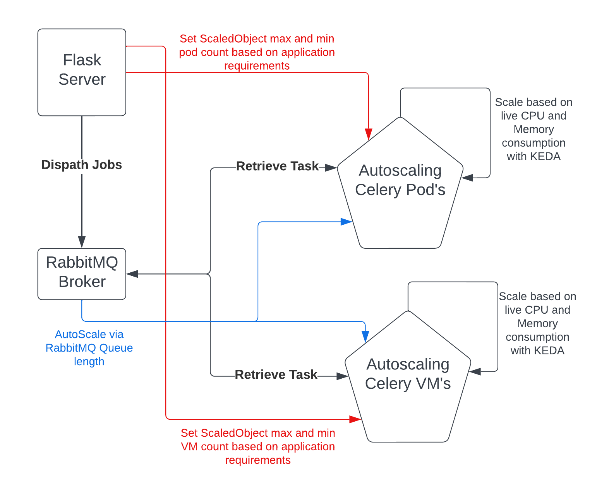
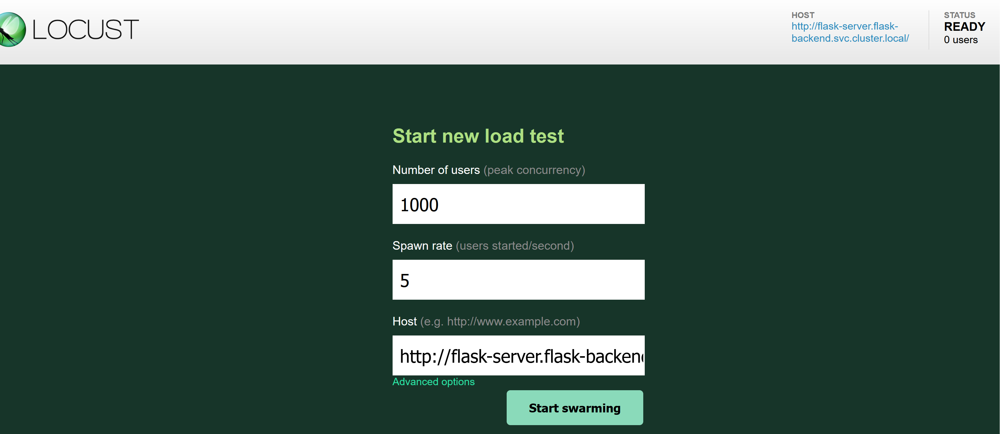
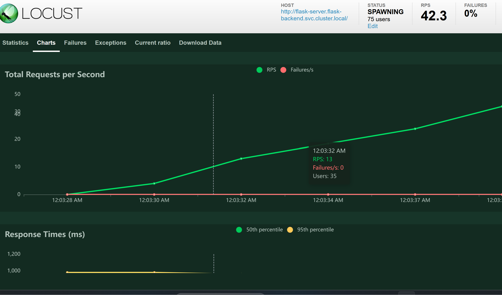
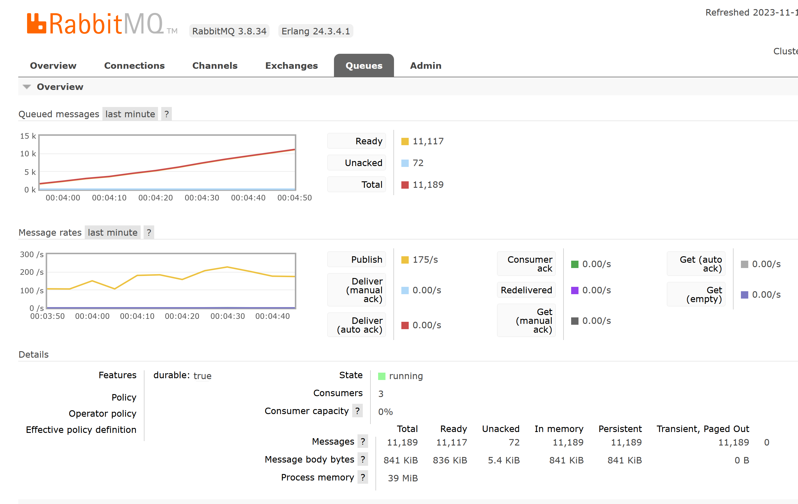
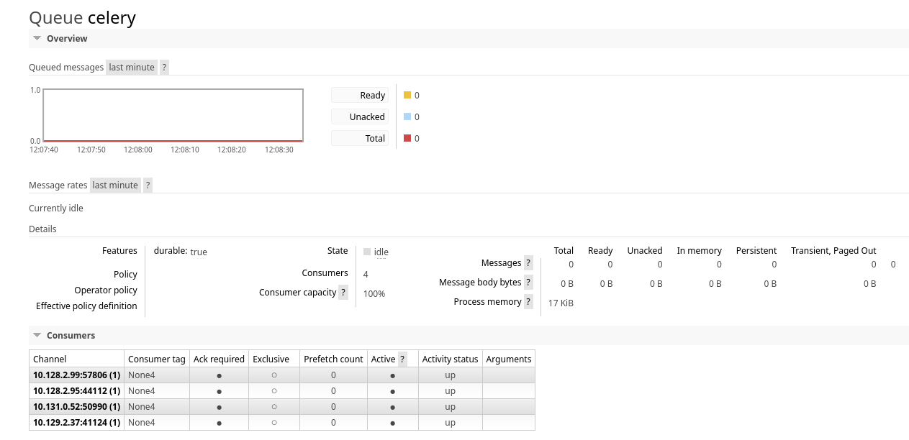
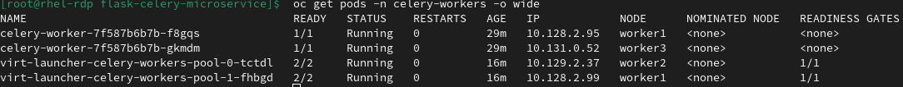

# flask-celery-vm-microservice

This repo acts as a proof of concept for showcasing:
- Autoscaling VirtualMachines and Pods with the [Custom Metrics Autoscaler - KEDA](https://docs.openshift.com/container-platform/4.13/nodes/cma/nodes-cma-autoscaling-custom.html) on OpenShift.
- Simulating manual scaling with the application being auto-scaled controlling the min and max replica count as desired.
- Working with mixed Pod and VM autoscaling.
- [Example of writing your own Autoscaler for VM's.](#solution-2-write-a-custom-autoscaler-for-vms)

 A lot of the code used here was from the the excellent work done here - [Scaling Celery workers with RabbitMQ on Kubernetes](https://learnk8s.io/scaling-celery-rabbitmq-kubernetes). I have updated it to:
 - Python version 3.9
 - Rewritten specifically for OpenShift Usage.
 - Added support for [VirtualMachines - OpenShift Virtualization](https://docs.openshift.com/container-platform/4.13/virt/about-virt.html)

## Solution 1: Leverage VMPools with HPA or KEDA
-----------------
## Architecture

TODO: Autoscaling via RabbitMQ queue length( Blue Color) not yet complete. Cluster metrics autoscaling on OCP does not yet support amqp but does support prometheus.

## Prerequsites
- Tested on OpenShift 4.13
- To build images Openshift registry must be available
- To use VM's - OpenShift Virtualization must be installed
- We need OCP Pipelines to build VM image
- To use the Tekton Virt customize task to build VM's we "seem" to need file based storage class.
- Enable user workload monitoring for scaling based on RabbitMQ queue length.

## Deployment Steps
- Build and Deploy our Flask Serve Application Image
Note: Pod image will fail until build is complete 

    ```bash
    oc apply -k ./flask-server-deploy
    ```
- Build and deploy our RabbitMQ image and Pod  

    ```bash
    oc apply -k ./rabbitmq
    oc start-build buildconfig/rabbitmq -n rabbitmq
    ```

- Deploy DB for Application
    ```bash
    oc apply -k ./postgresql
    ```

- Deploy Celery Pod Workers
    ```bash
    oc apply -k ./celery-workers
    ```

- Deploy Locust load testing utility
    ```bash
    oc apply -k ./locust
    ```

- You can install the Custom Metrics Autoscaler via console or create here.
    ```bash
    oc apply -k ./keda-operator/operator
    ```

  Wait for KEDA Operator Install then create controller.
  
    ```bash
    oc apply -k ./keda-operator/controller
    ```

- Deploy Celery VM's with pre-built image. [To Build your own VM image](#building-celery-vmsoptional)  

    ```bash
    oc apply -k ./celery-vm-workers/deploy
    ```

## How to Test
- Log into RabbitMQ to confirm Celery workers have registered as consumers
  Access RabbitMQ Mgmt URL at 
  ```bash
  echo "https://$(oc get route rabbitmq-mgmt -n rabbitmq -o jsonpath='{.spec.host}')"
  ```

  Username and Password are:
  ```bash
  oc extract secret/rabbitmq-secret -n rabbitmq --to=-
  ```

  Under the connections tab we should be able to see the IP address's for the VM's and Pod's
  ```bash
  oc get vmis -n celery-workers
  ```

  ```bash
  oc get pods -n celery-workers -o wide
  ```

- We can run a loadtest using the locust interface
  Obtain the Locust interface URL

  ```bash
  echo "https://$(oc get route locust -n locust -o jsonpath='{.spec.host}')"
  ```

  On the locust URL start a user with as many users and spawn rate as required (No of Users:100 and spawn count:10 - should trigger autoscale), the url should already be pointing to the flask server endpoint.
  

  With our test started we should be getting data on locust charts.
  

  We should also be able to see data on RabbitMQ's Queue Tab specifically for the Celery Queue and see how much each consumer is processing.
  

  And confirm the Registered consumers are our pods and vm's via their IP addresses.
  

  

- Being testing KEDA with [enabled user workload monitoring](https://docs.openshift.com/container-platform/4.13/monitoring/enabling-monitoring-for-user-defined-projects.html)
  ```bash
  cat << EOF | oc create -f -
  apiVersion: v1
  kind: ConfigMap
  metadata:
    name: cluster-monitoring-config
    namespace: openshift-monitoring
  data:
    config.yaml: |
      enableUserWorkload: true
  EOF
  ```

- To allow CPU and memory Autoscaling we can deploy scaledobject's for VM's and Pods.Note!!! - The KEDA behaviour with VM's seems a bit inconsistent. I am troubleshooting.

    ```bash
    oc create serviceaccount thanos -n celery-workers
    export SA_TOKEN=$(oc describe sa/thanos -n celery-workers  | grep -i Tokens | awk '{print $2}')  
    oc kustomize ./keda | envsubst | oc apply -f - 
    ```

- You can re-run the locust test above to see how it handles autoscaling.

### Simulate Application Manual Scaling 
To simulate the application use-case where the application might want to be able to pre-scale or use it's own logic to control scaling. We send a curl request to our flask application which has embedded logic(it just shells out to oc cmd line) to scale down our instances.

- Set the VM's max replicas to 6

```bash
curl -X POST -i "http://$(oc get route flask-server -n flask-backend -o jsonpath='{.spec.host}')/replica?maxreplicacount=6&scaledobject=vm-scaledobject"
```

- Set the Pod's min replicas to 2
```bash
curl -X POST -i "http://$(oc get route flask-server -n flask-backend -o jsonpath='{.spec.host}')/replica?minreplicacount=2&scaledobject=pod-scaledobject"
```


### Building Celery VM's(Optional)
You can build the VM image or use the pre-built image. 

- Build VM Image
    To build the image we need a StorageClass that supports filesystems, export the name of the storageclass:

    ```bash
    export STORAGECLASS_NAME=ocs-storagecluster-cephfs
    ```

    Export the Registry of the output image e.g.

    ```bash
    export OUTPUT_IMAGE=quay.io/mooyeg/containerdisk-celery:latest
    ```

    [Create a secret with credentials for your registry](https://docs.openshift.com/container-platform/4.10/openshift_images/managing_images/using-image-pull-secrets.html#images-allow-pods-to-reference-images-from-secure-registries_using-image-pull-secrets)

    Create the necessary manifests to build your image.(Might need to restart pipelinerun)

    ```bash
    oc kustomize ./celery-vm-workers/build-image/ | envsubst | oc apply -f -   
    ```

    Link your registry pull-secret with your serviceaccount 

    ```bash
    oc secrets link pipelines-sa-userid-1000 quay-pull-secret -n celery-workers --for=pull,mount    
    ```

## Solution 2: Write a Custom Autoscaler for VM's.
   - [Code for Autoscaler App can be found here](./ocp_virt_autoscale_app/)

   - To Deploy custom autoscale App
     ```bash
     oc apply -k ./ocp_virt_autoscale_app//deploy-manifest
     ```

### Enable Autoscaling via RabbitMQ Queue Length(TODO)
```bash
oc create serviceaccount thanos -n celery-workers
export SA_TOKEN=$(oc describe sa/thanos -n celery-workers  | grep -i Tokens | awk '{print $2}')  
oc kustomize ./keda | envsubst | oc apply -f -  
```

## Clean up
```bash
oc kustomize ./keda | envsubst | oc delete -f -  
oc kustomize ./celery-vm-workers/build-image/ | envsubst | oc delete -f -   
oc delete -k ./keda
oc delete -k ./celery-vm-workers/deploy
oc delete -k ./keda-operator/controller
oc delete -k ./keda-operator/operator
oc delete -k ./locust
oc delete -k ./celery-workers
oc delete -k ./postgresql
oc delete -k ./rabbitmq
oc delete -k ./flask-server-deploy
```
## One-Line Create
```bash
oc apply -k ./flask-server-deploy
oc apply -k ./rabbitmq
oc start-build buildconfig/rabbitmq -n rabbitmq
oc apply -k ./postgresql
oc apply -k ./celery-workers
oc apply -k ./locust
oc apply -k ./keda-operator/operator
oc apply -k ./keda-operator/controller
oc apply -k ./celery-vm-workers/deploy
oc kustomize ./celery-vm-workers/build-image/ | envsubst | oc apply -f -
oc create serviceaccount thanos -n celery-workers
export SA_TOKEN=$(oc describe sa/thanos -n celery-workers  | grep -i Tokens | awk '{print $2}')
oc kustomize ./keda | envsubst | oc apply -f - 
```


